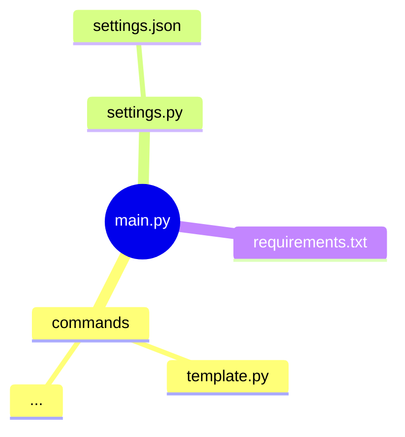

# Discord selfbot template
### Default structure

### Why does some commands no worky???!?1/1
I removed my own keys from this project, these files contains this template: "\<PUT YOUR KEY HERE\>", replace them with the keys needed
These files needs keys now:
1. historicalfact
2. dnslookup

### How to run it

1. Run ``pip install -r requirements.txt``
2. Add user discord token in ``settings.json`` ***in the correct field***
3. Add your userid in the correct field in ``settings.json``
> This is due that DISCORD S.C.U.M, what my selfbot uses, doesnt have a good function to do that automatically without doing multiple request and a hell lot of thinkering 
4. Run ``python main.py``

### How to get discord token of my login session
 
To get your discord token, use this in console:

> ``(webpackChunkdiscord_app.push([[''],{},e=>{m=[];for(let c in e.c)m.push(e.c[c])}]),m).find(m => m?.exports?.default?.getToken).exports.default.getToken()``

Or get ``authorization`` from a discord get/post request

### How do I add commands
Sadly you need to make them yourself, you can use the template in ``./commands`` for this specific purpose

### Requirements (Taken from requirements.txt)
- Brotli==1.1.0
- certifi==2023.11.17
- charset-normalizer==3.3.2
- colorama==0.4.6
- discum @ git+https://github.com/Merubokkusu/Discord-S.C.U.M.git@3a3d9334f66e2f7c7954fcb616a06c52b252804e
- filetype==1.2.0
- idna==3.4
- requests==2.31.0
- requests-toolbelt==1.0.0
- six==1.16.0
- ua-parser==0.18.0
- urllib3==2.1.0
- websocket-client==0.59.0

### Credits
- Myself (SRK1D)
